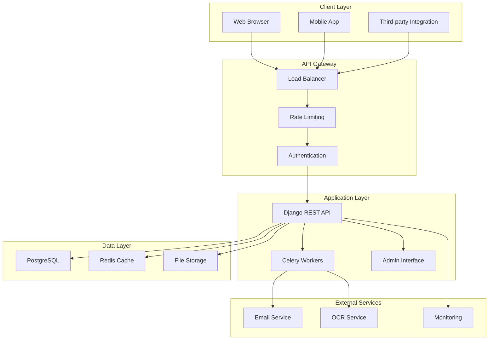
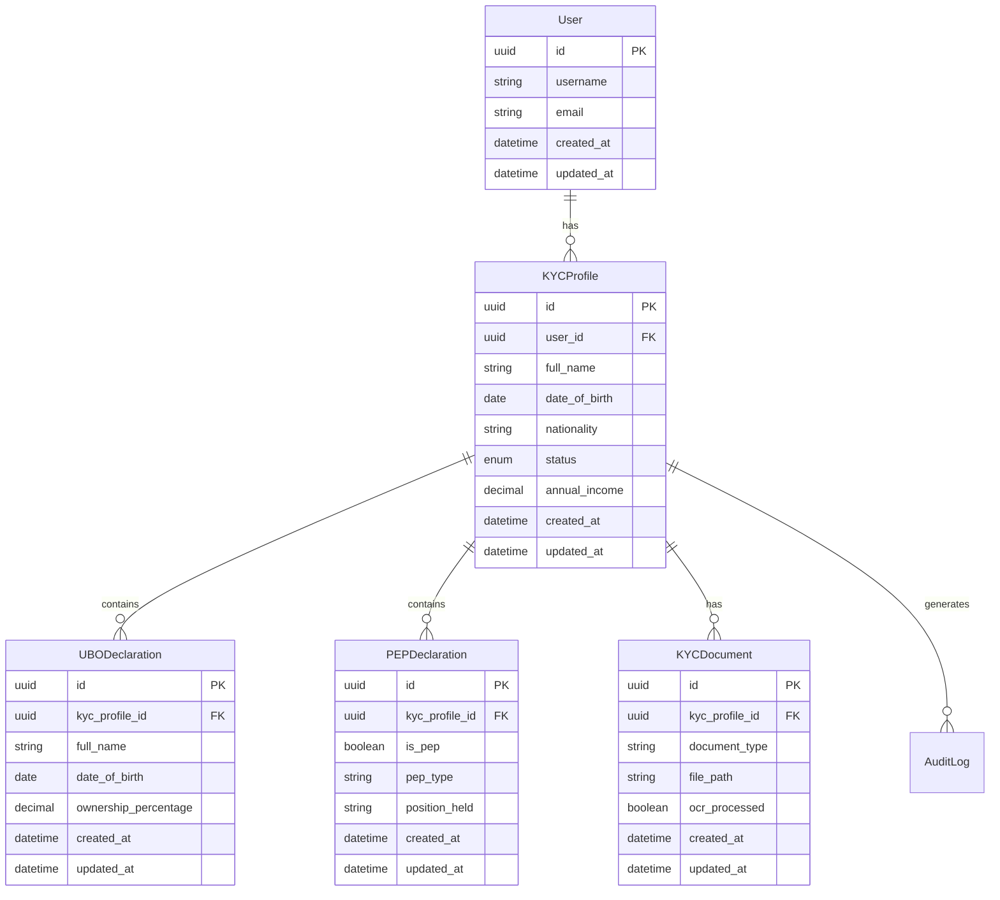
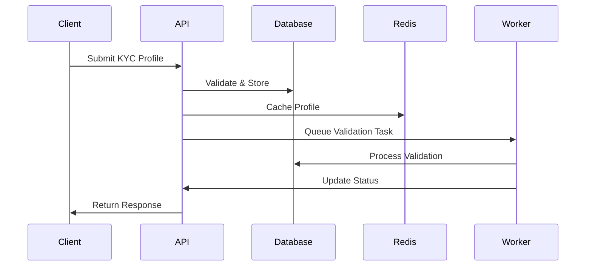
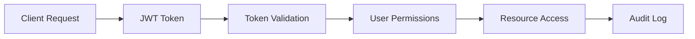
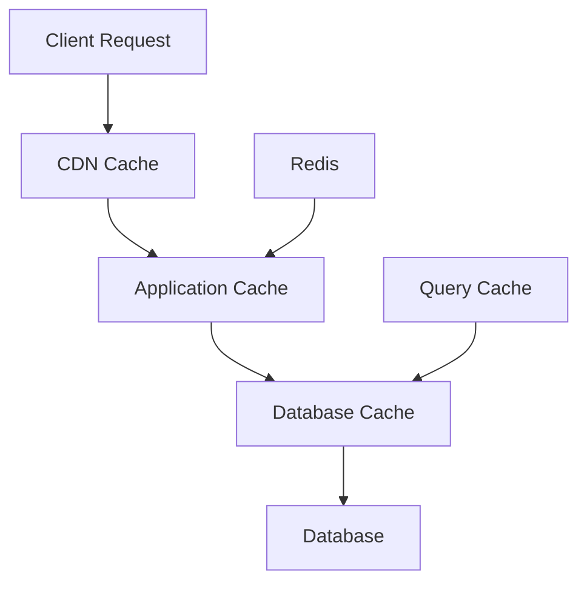
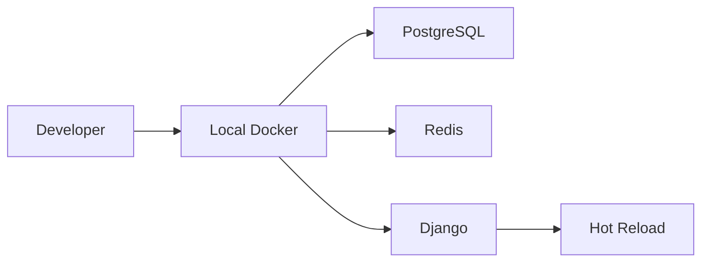
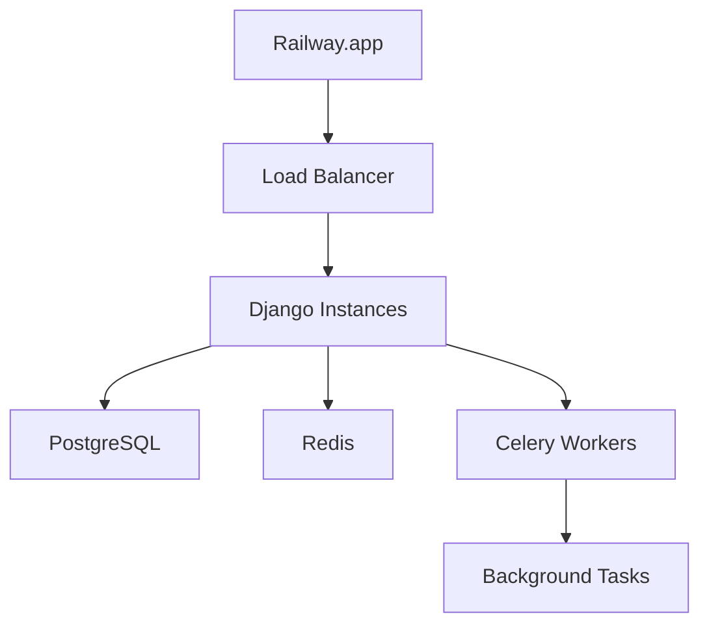

# Architecture Overview

The ONBOARDING platform is built with a modern, scalable architecture that prioritizes security, performance, and maintainability. This section provides a comprehensive overview of the system's design and components.

## 🏗️ High-Level Architecture

## 🎯 Design Principles

### 1. Security First
- **Zero Trust Architecture** - Every request is authenticated and authorized
- **Defense in Depth** - Multiple layers of security controls
- **Data Protection** - Encryption at rest and in transit
- **Audit Trail** - Complete logging of all operations

### 2. Scalability
- **Horizontal Scaling** - Stateless application design
- **Async Processing** - Background tasks for heavy operations
- **Caching Strategy** - Multi-level caching for performance
- **Database Optimization** - Efficient queries and indexing

### 3. Maintainability
- **Clean Architecture** - Separation of concerns
- **Test-Driven Development** - Comprehensive test coverage
- **Documentation** - Self-documenting code and APIs
- **Monitoring** - Observability at all levels

### 4. Compliance
- **GDPR Ready** - Data protection and privacy controls
- **Audit Compliance** - Complete audit trails
- **Data Retention** - Configurable retention policies
- **Access Controls** - Role-based permissions

## 🔧 Technology Stack

### Backend
| Component | Technology | Version | Purpose |
|-----------|------------|---------|---------|
| **Framework** | Django | 5.0 LTS | Web framework |
| **API** | Django REST Framework | 3.15 | REST API |
| **Database** | PostgreSQL | 15+ | Primary database |
| **Cache** | Redis | 7+ | Caching & sessions |
| **Task Queue** | Celery | 5.4 | Background tasks |
| **Authentication** | JWT | - | Token-based auth |

### Frontend
| Component | Technology | Version | Purpose |
|-----------|------------|---------|---------|
| **Framework** | React | 18+ | UI framework |
| **State Management** | Redux Toolkit | - | State management |
| **Routing** | React Router | - | Client-side routing |
| **UI Components** | Material-UI | - | Component library |
| **HTTP Client** | Axios | - | API communication |

### Infrastructure
| Component | Technology | Purpose |
|-----------|------------|---------|
| **Containerization** | Docker | Application packaging |
| **Orchestration** | Docker Compose | Local development |
| **Deployment** | Railway.app | Cloud hosting |
| **CI/CD** | GitHub Actions | Automation |
| **Monitoring** | Built-in | Health checks |

## 📊 Data Architecture

### Database Design

### Data Flow

## 🔒 Security Architecture

### Authentication & Authorization

### Security Layers

1. **Network Security**
   - HTTPS/TLS encryption
   - CORS configuration
   - Rate limiting
   - IP whitelisting

2. **Application Security**
   - JWT authentication
   - Role-based access control
   - Input validation
   - SQL injection prevention

3. **Data Security**
   - Encryption at rest
   - Sensitive data masking
   - Secure file storage
   - Data anonymization

4. **Operational Security**
   - Security headers
   - Audit logging
   - Monitoring & alerting
   - Incident response

## ⚡ Performance Architecture

### Caching Strategy

### Performance Optimizations

1. **Database Level**
   - Optimized queries
   - Proper indexing
   - Connection pooling
   - Query caching

2. **Application Level**
   - Redis caching
   - Session management
   - Static file optimization
   - Async processing

3. **Infrastructure Level**
   - Load balancing
   - CDN integration
   - Horizontal scaling
   - Resource monitoring

## 🔄 Deployment Architecture

### Development Environment

### Production Environment

## 📈 Scalability Considerations

### Horizontal Scaling
- Stateless application design
- Database read replicas
- Distributed caching
- Load balancing

### Vertical Scaling
- Resource optimization
- Performance monitoring
- Capacity planning
- Auto-scaling

### Future Enhancements
- Microservices migration
- Event-driven architecture
- API versioning
- Multi-region deployment

## 🔍 Monitoring & Observability

### Health Checks
- Application health endpoints
- Database connectivity
- Cache availability
- External service status

### Logging
- Structured logging
- Centralized log aggregation
- Error tracking
- Performance metrics

### Metrics
- Response times
- Error rates
- Resource utilization
- Business metrics

---

**Next**: Explore specific components:
- [Backend Architecture](backend.md)
- [Frontend Architecture](frontend.md)
- [Database Design](database.md)
- [Security Implementation](security.md)

