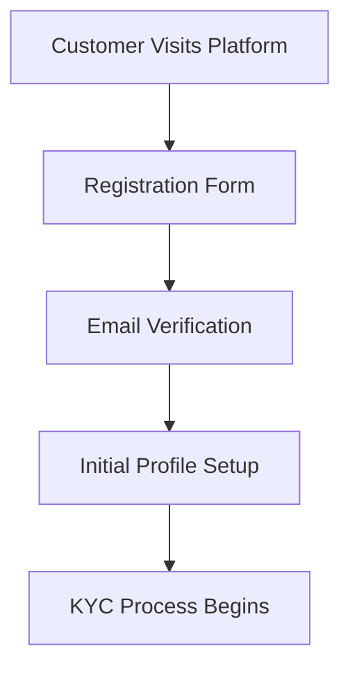

# BTS Global Bank - Digital KYC Platform

Welcome to the **BTS Global Bank Digital KYC Platform** documentation. This comprehensive guide will help you understand, implement, and maintain our cutting-edge Know Your Customer (KYC) solution.

> **be anywhere** - Secure, efficient, and compliant digital banking for the global economy.

## 🌟 Platform Overview

BTS Global Bank's Digital KYC Platform is a state-of-the-art solution designed to streamline customer onboarding while ensuring the highest levels of security and regulatory compliance. Our platform serves financial institutions worldwide, providing:

- **Automated KYC verification** with AI-powered document analysis
- **Real-time risk assessment** and fraud detection
- **Global compliance** with international regulations
- **Seamless user experience** across all devices
- **Enterprise-grade security** with bank-level encryption

## 🏗️ Architecture

### Technology Stack

**Backend Infrastructure:**
- **Django 5.0 LTS** - Robust web framework with long-term support
- **Django REST Framework 3.15** - Powerful API development toolkit
- **PostgreSQL 15** - Advanced relational database with JSON support
- **Redis 7** - High-performance caching and session management
- **Celery 5.4** - Distributed task queue for background processing

**Frontend Experience:**
- **React 18** - Modern user interface with concurrent features
- **Redux Toolkit** - Predictable state management
- **Material-UI** - Professional component library
- **React Router 6** - Declarative routing solution

**Infrastructure & DevOps:**
- **Railway.app** - Cloud-native deployment platform
- **GitHub Actions** - Automated CI/CD pipeline
- **Docker** - Containerized application deployment
- **Nginx** - High-performance reverse proxy

### Security Framework

Our platform implements multiple layers of security:

1. **Transport Security**
   - TLS 1.3 encryption for all communications
   - HSTS headers for secure connections
   - Certificate pinning for API endpoints

2. **Application Security**
   - JWT-based authentication with refresh tokens
   - CSRF protection on all state-changing operations
   - XSS prevention with content security policies
   - SQL injection prevention with parameterized queries

3. **Data Protection**
   - AES-256 encryption for sensitive data at rest
   - Field-level encryption for PII
   - Secure key management with rotation
   - GDPR-compliant data handling

## 🔄 KYC Process Flow

### 1. Customer Registration


### 2. Document Verification
- **Identity Documents**: Passport, National ID, Driver's License
- **Proof of Address**: Utility bills, Bank statements, Government letters
- **Business Documents**: Registration certificates, Tax documents (for corporate accounts)

### 3. Risk Assessment
Our AI-powered risk engine evaluates:
- **Document authenticity** using OCR and machine learning
- **Biometric verification** with facial recognition
- **PEP screening** against global watchlists
- **UBO analysis** for corporate structures
- **Sanctions checking** in real-time

### 4. Compliance Verification
- **AML (Anti-Money Laundering)** compliance checks
- **KYC (Know Your Customer)** verification
- **GDPR** data protection compliance
- **Local regulatory** requirements

## 🌍 Global Compliance

### Supported Jurisdictions
- **European Union** - GDPR, MiFID II, 5AMLD
- **United States** - BSA, USA PATRIOT Act, FinCEN
- **United Kingdom** - FCA regulations, MLR 2017
- **Asia-Pacific** - MAS, AUSTRAC, JFSA guidelines
- **Latin America** - Local banking regulations

### Regulatory Features
- **Automated compliance reporting** to regulatory bodies
- **Audit trails** with immutable logging
- **Data retention policies** with automatic purging
- **Regulatory change management** with automatic updates

## 🚀 Getting Started

### Quick Setup

1. **Clone the Repository**
   ```bash
   git clone https://github.com/carlossilvatbh/onboarding-platform.git
   cd onboarding-platform
   ```

2. **Environment Setup**
   ```bash
   # Backend
   cd backend
   python -m venv venv
   source venv/bin/activate
   pip install -r requirements.txt
   
   # Frontend
   cd ../frontend
   npm install
   ```

3. **Configuration**
   ```bash
   cp .env.example .env
   # Edit .env with your settings
   ```

4. **Database Migration**
   ```bash
   python manage.py migrate
   python manage.py createsuperuser
   ```

5. **Start Development**
   ```bash
   # Backend
   python manage.py runserver
   
   # Frontend (new terminal)
   npm start
   ```

### Production Deployment

For production deployment on Railway.app:

```bash
# Connect to Railway
railway login
railway link

# Set environment variables
railway variables set DATABASE_URL=postgresql://...
railway variables set SECRET_KEY=...

# Deploy
railway up
```

## 📊 Performance Metrics

### Benchmarks
- **API Response Time**: < 200ms average
- **Document Processing**: < 30 seconds
- **Concurrent Users**: 10,000+ supported
- **Uptime**: 99.9% SLA
- **Data Processing**: 1M+ documents/day capacity

### Monitoring
- Real-time performance dashboards
- Automated alerting for anomalies
- Comprehensive logging and analytics
- Health check endpoints

## 🔧 Customization

### Branding
The platform supports complete white-label customization:
- Custom logos and color schemes
- Branded email templates
- Customizable user interface
- Multi-language support

### Integration
- **RESTful APIs** for seamless integration
- **Webhook notifications** for real-time updates
- **SDK libraries** for popular programming languages
- **Plugin architecture** for custom extensions

## 📚 API Reference

### Authentication
```http
POST /api/auth/login/
Content-Type: application/json

{
  "email": "user@example.com",
  "password": "secure_password"
}
```

### KYC Profile
```http
GET /api/kyc/profile/
Authorization: Bearer <jwt_token>
```

### Document Upload
```http
POST /api/kyc/documents/
Authorization: Bearer <jwt_token>
Content-Type: multipart/form-data

document: <file>
document_type: "passport"
```

## 🆘 Support & Resources

### Documentation
- [Getting Started Guide](getting-started/)
- [API Documentation](api/)
- [Architecture Overview](architecture/)
- [Security Guidelines](security/)
- [Deployment Guide](deployment/)

### Community
- [GitHub Repository](https://github.com/carlossilvatbh/onboarding-platform)
- [Issue Tracker](https://github.com/carlossilvatbh/onboarding-platform/issues)
- [Discussions](https://github.com/carlossilvatbh/onboarding-platform/discussions)

### Professional Support
- **Email**: support@btsglobalbank.com
- **Phone**: +1 (555) 123-4567
- **Website**: [btsglobalbank.com](https://btsglobalbank.com)

---

**BTS Global Bank** - Empowering global finance with secure, compliant, and efficient digital solutions.

*be anywhere* 🌍

