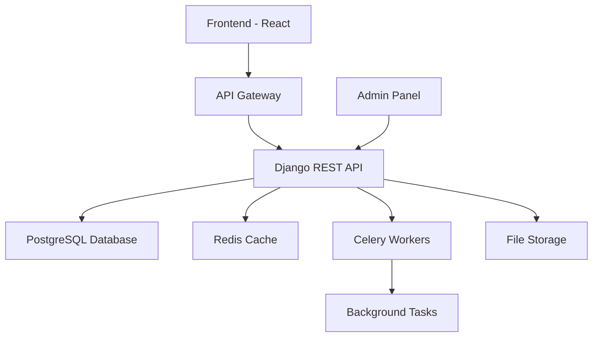

# ONBOARDING - Digital KYC Platform

Welcome to the comprehensive documentation for the **ONBOARDING** digital KYC (Know Your Customer) platform. This documentation provides everything you need to understand, deploy, and maintain the platform.

## 🚀 What is ONBOARDING?

ONBOARDING is a modern, secure, and scalable digital KYC platform built with Django REST Framework and React. It provides comprehensive customer onboarding capabilities including:

- **KYC Profile Management** - Complete customer profile creation and management
- **UBO Declarations** - Ultimate Beneficial Owner declaration and validation
- **PEP Screening** - Politically Exposed Person screening and monitoring
- **Document Management** - Secure document upload, storage, and OCR processing
- **Multi-language Support** - Full internationalization (English/Portuguese)
- **API-First Design** - RESTful APIs for seamless integration

## ✨ Key Features

### 🔒 Security First
- Django security best practices
- JWT authentication
- Role-based access control
- Data encryption at rest and in transit
- GDPR compliance ready

### 🌍 International Ready
- Multi-language support (EN/PT-BR)
- Localized date/time formats
- Currency and number formatting
- RTL language support ready

### 📊 Scalable Architecture
- Microservices-ready design
- Async task processing with Celery
- Redis caching
- PostgreSQL database
- Docker containerization

### 🧪 Quality Assured
- 80%+ test coverage
- Automated CI/CD pipeline
- Code quality checks
- Security scanning
- Performance monitoring

## 🏗️ Architecture Overview



## 🚀 Quick Start

Get up and running in minutes:

1. **Clone the repository**
   ```bash
   git clone https://github.com/onboarding-team/onboarding.git
   cd onboarding
   ```

2. **Set up the environment**
   ```bash
   chmod +x setup.sh
   ./setup.sh
   ```

3. **Start the development server**
   ```bash
   docker-compose up -d
   ```

4. **Access the application**
   - API: http://localhost:8000/api/
   - Admin: http://localhost:8000/admin/
   - Docs: http://localhost:8000/api/docs/

## 📚 Documentation Sections

### 🏁 [Getting Started](getting-started/index.md)
Everything you need to get the platform running locally or in production.

### 🏗️ [Architecture](architecture/index.md)
Deep dive into the platform's architecture, design decisions, and technical details.

### 🔌 [API Documentation](api/index.md)
Complete API reference with examples and integration guides.

### 💻 [Development](development/index.md)
Guidelines for contributing to the project, coding standards, and development workflows.

### 🚀 [Deployment](deployment/index.md)
Production deployment guides for various platforms and environments.

### 👥 [User Guide](user-guide/index.md)
End-user documentation for administrators and operators.

### 🔒 [Security](security/index.md)
Security considerations, best practices, and compliance information.

### 📖 [Reference](reference/index.md)
Technical reference materials, configuration options, and utilities.

## 🆘 Need Help?

- **Issues**: [GitHub Issues](https://github.com/onboarding-team/onboarding/issues)
- **Discussions**: [GitHub Discussions](https://github.com/onboarding-team/onboarding/discussions)
- **Email**: support@onboarding-platform.com

## 🤝 Contributing

We welcome contributions! Please see our [Contributing Guide](development/contributing.md) for details on how to get started.

## 📄 License

This project is licensed under the MIT License - see the [LICENSE](https://github.com/onboarding-team/onboarding/blob/main/LICENSE) file for details.

---

**Last Updated**: June 15, 2025  
**Version**: 1.0.0  
**Status**: ✅ Production Ready

